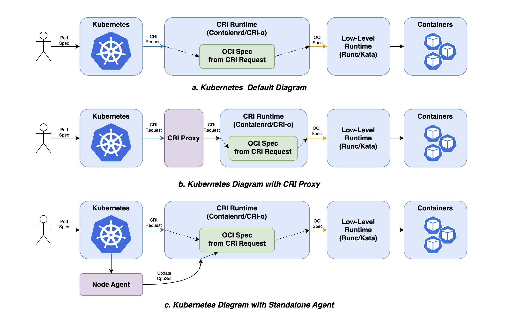
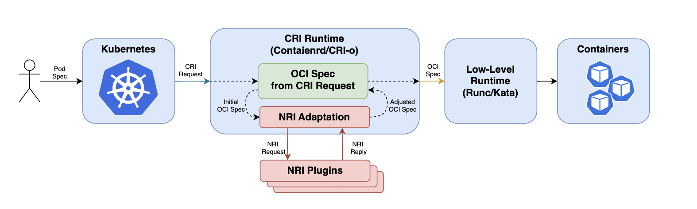

# NRI:下一代节点细粒度资源控制方案

## 1. 背景

为了满足不同业务应用场景的需求，特别是在在线任务与离线任务混布的场景下，在提高资源利用率的同时，也要保证延迟敏感服务可以得到充分的资源保证，这就需要Kubernetes提供更加细粒度的资源管理功能，增强容器的隔离性，减少容器之间的互相干扰。例如，CPU编排，内存分层，缓存管理，IO管理等。目前有很多方案，但是都有其一定的局限性。 

截至目前，Kubernetes并没有提供一个非常完善的资源管理方案，很多Kubernetes周边的开源项目通过一些自己的方式修改Pod的部署和管理流程，实现资源分配的细粒度管理。例如[CRI-RM](https://github.com/intel/cri-resource-manager )，[Koordinator](https://koordinator.sh )，[Crane](https://gocrane.io )等项目。 

这些项目对Kubernetes创建和更新Pod的流程的优化可以大致分为两种模式，一种是 Proxy模式，一种是Standalone模式。 



在目前的K8s架构中，如图a，Kubelet通过调用CRI兼容的容器运行时创建和管理Pod。CRI Runtime再通过调用OCI兼容的Low-level Runtime创建Container。 

### Proxy模式

Proxy模式(如图b)则是在客户端(Kubelet)和CRI Runtime(containerd,CRI-O等) 之间增加一个CRI Proxy中继请求和响应，在Proxy中劫持Pod以及Container的创建/更新/删除事件，对Pod的Spec进行修改或者完善，将硬件感知的资源分配策略应用于容器中。 

### Standalone模式

Standalone模式(如图c)则是在每一个Work Node上创建一个Agent，当这个Agent监听到在本节点的Pod创建或者修改事件的时候，再根据Pod Spec中的annotation，转换成细粒度资源配置的Spec，然后调用CRI Runtime实现对Pod的更新。 

这两种方式在满足特定业务需求的同时也存在一定的缺点, 两种方式都需要依赖额外的组件，来捕获Pod的生命周期事件。Proxy 模式增加了Pod创建管理流程的链路以及部署和维护成本，Standalone 模式是在侦听到Pod创建以及修改的事件后，才会对Pod进行更新，会有一定的延迟。 


## 2. NRI 简介
为了解决现有方案的问题，让开发者有一种更统一的实现方式，从而尽可能的提高资源调度插件的复用能力，[NRI](https://github.com/containerd/nri)应运而出。NRI的概念于[2021 Europe Kubecon](https://kccnceu2021.sched.com/event/iE1Y/maximizing-workloads-performance-with-smarter-runtimes-krisztian-litkey-alexander-kanevskiy-intel)首次被提出，到现在已经经历了[两个版本](https://kccncna2022.sched.com/event/182JT)的迭代。

NRI(Node Resource Interface), 是用于控制节点资源的公共接口, 是CRI兼容的容器运行时插件扩展的通用框架。它为扩展插件提供了跟踪容器状态，并对其配置进行有限修改的基本机制。

上图红色部分显示了NRI 以及NRI插件在整个Kubernetes的Pod创建流程的位置。NRI 插件(NRI Plugin)与NRI Adaptation之间是通过Unix Domain Socket 进行通信。 

目前，NRI已经演进到了2.0 版本，相对于1.0版本进行了重构，增加了更加丰富的hook函数。 

NRI是Containerd的一个子项目， NRI允许将自定义的业务逻辑插入到CRI兼容的运行时中，例如，Containerd, CRI-O。 在容器的生命周期中，这些逻辑可以对容器的Spec进行修改，或者在确定的hook点做一些OCI范围之外的操作。NRI可以用于进一步完善设备或者其他资源的分配和管理。NRI本身对任何容器运行时(CRI Runtime)的内部实现细节是不感知的。它为CRI运行时提供了一个适配库，用于集成NRI和扩展插件进行交互。 

NRI提供了接口定义和基础组件，可以实现可插拔的CRI运行时插件，这些插件就是NRI 插件(NRI Plugin)。这些NRI插件是与运行时类型无关的，插件既可以应用于Containerd，也可以应用CRI-O。原则上，任何NRI插件(NRI Plugin)都应该能够和启用NRI的运行时(NRI-enabled CRI Runtimes)正常协作。 

NRI 插件是一个类似守护进程的实例。插件的单个实例会处理NRI所有的事件和请求，使用Unix-domain socket来进行数据传输和通信，NRI定义了一套基于protobuf的协议--NRI plugin protocal--并通过ttRPC进行实现。这样可以通过降低每条信息的开销提高通信效率，并且可以实现有状态的NRI插件。 

## 3. NRI组件以及工作原理

NRI的实现包含多个组件，每个组件组件对于在运行时中实现端到端的NRI支持都至关重要。最主要的两个组件是，NRI API 和NRI运行时适配器(NRI Runtime Adaptation)。这些组件共同建立了运行时如何与NRI交互，NRI插件如何与Runtime的容器进行交互的模型。同时还定义了插件可以在哪些条件下对容器进行修改以及可以更改的范围。 

### NRI API

NRI底层的核心是由protobuf协议定义的底层插件API。这个API定义了两个服务， 运行时服务(Runtime Service)和 插件服务(Plugin Service)。 

运行时服务(NRI Runtime Service)是CRI运行时暴露给NRI插件的公共接口。这个接口上所有的请求都由NRI插件发起的。这个接口提供了以下功能。 

- 启动插件注册 
- 请求主动更新容器 

插件服务(NRI Plugin Service)是运行时和NRI插件进行交互的公共接口。这个接口上请求都是由NRI插件或者Runtime发起的。这个接口提供了以下功能。 

- 配置NRI插件 

- 获取已经存在的Pod和Contaienr的初始列表 
- 把插件挂载到Pod/contaienr 的生命周期事件中 
- 关闭插件 

在NRI插件开始接受和处理容器事件之前，它需要向NRI注册自己。在注册过程中，NRI 插件和NRI之间会执行一个握手过程， 这个过程包含以下几步： 

1. 插件向运行时标识自己 

1. NRI为插件提供特定的配置 

1. 插件根据需求订阅Pod或者Container的生命周期事件 

1. NRI向插件发送现有的pod或Container的列表 

1. 插件请求对现有容器的更新 

NRI插件通过唯一的索引和插件名向NRI 服务标识自己。NRI会通过插件的索引来决定插件的调用顺序。 

NRI插件名称用于NRI服务从默认插件配置路径`/etc/nri/conf.d`选择对应插件的配置文件发送给NRI插件。只有当对应的NRI插件被NRI服务内部调用时，才会读取对应的配置文件。如果NRI插件是从外部启动的，那么它也可以通过其他方式获取配置。NRI插件可以根据需要订阅Pod和Container的生命周期，并且返回修改的配置。NRI插件如果采用预注册的方式运行时，需要将可执行文件的命名规则需要符合`xx-plugin_name`，例如`01-logger`。其中`xx`必须为两位数字，作为NRI插件的索引，决定了插件的的执行顺序。 

在注册和握手的最后一步，NRI发送CRI 运行时已知的所有的Pod和Contaienr的信息。此时插件可以对任何已经存在的Pod和Container进行更新。 

一旦握手结束，并且NRI插件成功向NRI服务注册之后，它将开始根据自己的订阅接收Pod和Container 的生命周期事件。 

### 运行时适配器

NRI 运行时适配器(NRI Runtime Adaptation)是CRI运行时集成到NRI和与NRI交互的接口。它实现了插件发现，启动和配置。它还提供了将NRI插件插入到CRI运行时的Pod和Container的生命周期事件中的必要功能。 

运行时适配器实现了多个NRI插件可能在处理同一个Pod或者Container的生命周期事件。它负责按照索引顺序依次调用插件，并把插件的修改内容合并后返回。在合并插件修改的OCI Spec时，当检测到到多个NRI插件对同一个Container产生了冲突的修改，就会返回一个错误。 

### 其他组件

NRI还包含一个NRI插件Stub库(NRI Plugin Stub Library)，为NRI 插件的实现提供了一个简洁易用的框架。NRI插件Stub库隐藏了NRI插件的底层实现细节，它负责连接建立、插件注册、配置和事件订阅。 

同时NRI也提供了一些NRI 插件的示例，这些示例都是结合实际使用场景创建的，其中一些示例非常适合调试场景。目前，NRI提供的所有示例插件都基于Stub库实现的。这些示例插件的实现都可以用作学习使用Stub库的教程。 

另外，NRI还包含一个OCI规范生成器(Wrapped OCI Spec Generator)主要用于NRI 插件用来调整和更新OCI Spec, 然后更新到Container。 

## 4. NRI 订阅的的Pod/Container的元信息和事件

### Pod元信息和可用的生命周期事件
NRI插件可以订阅的Pod生命周期事件目前有3个：`RunPodSandbox`,`StopPodSandbox`和`RemovePodSandbox`. 

```go
type handlers struct {
   RunPodSandbox       func(*api.PodSandbox) error
   StopPodSandbox      func(*api.PodSandbox) error
   RemovePodSandbox    func(*api.PodSandbox) error
   ...
}
```

从以下代码中我们可以看到在事件中可以获得的Pod的元信息。

```go
// https://github.com/containerd/nri/blob/v0.3.0/pkg/api/api.pb.go#L1015
type PodSandbox struct {
	Id             string           
	Name           string            
	Uid            string           
	Namespace      string           
	Labels         map[string]string 
	Annotations    map[string]string 
	RuntimeHandler string            
	Linux          *LinuxPodSandbox  
	Pid            uint32            
}
type LinuxPodSandbox struct {
	CgroupParent string 
	CgroupsPath  string            
}
```

### Container 元信息和可用生命周期事件
NRI插件可以订阅的Container生命周期事件目前有8个：
```go
type handlers struct {
  ...
	CreateContainer     func(*api.PodSandbox, *api.Container) (*api.ContainerAdjustment, []*api.ContainerUpdate, error)
	StartContainer      func(*api.PodSandbox, *api.Container) error
	UpdateContainer     func(*api.PodSandbox, *api.Container) ([]*api.ContainerUpdate, error)
	StopContainer       func(*api.PodSandbox, *api.Container) ([]*api.ContainerUpdate, error)
	RemoveContainer     func(*api.PodSandbox, *api.Container) error
	PostCreateContainer func(*api.PodSandbox, *api.Container) error
	PostStartContainer  func(*api.PodSandbox, *api.Container) error
	PostUpdateContainer func(*api.PodSandbox, *api.Container) error
  ...
}
```

从以下代码中我们可以看到在事件中可以获得的Container 的元信息。
```go
// https://github.com/containerd/nri/blob/v0.3.0/pkg/api/api.pb.go#L1215
// Container metadata that is considered relevant for a plugin.
type Container struct {
	Id string 
	PodSandboxId string 
	Name string 
	State ContainerState 
	Labels map[string]string 
	Annotations map[string]string 
	Args []string 
	Env []string 
	Mounts []*Mount 
	Hooks *Hooks 
	Linux *LinuxContainer 
	Pid uint32 
}
type LinuxContainer struct {  
	Namespaces  []*LinuxNamespace 
	Devices     []*LinuxDevice    
	Resources   *LinuxResources   
	OomScoreAdj *OptionalInt      
	CgroupsPath string            
}
type LinuxResources struct {
	Memory         *LinuxMemory         
	Cpu            *LinuxCPU            
	HugepageLimits []*HugepageLimit     
	BlockioClass   *OptionalString      
	RdtClass       *OptionalString       
	Devices        []*LinuxDeviceCgroup 
}
```


### Container 调整和更新

在Container 创建过程中可以调整Container的参数，在Container创建后，任何生命周期事件都可以更新Container的参数，但是调整参数和更新参数的范围是不同的，Container创建时支持更多的参数设置，Container创建完成后，只有部分参数可以修改。

创建过程中, Container 可以被调整的参数,如下：

```go
// https://github.com/containerd/nri/blob/v0.3.0/pkg/api/api.pb.go#L2246
// Requested adjustments to a container being created.
type ContainerAdjustment struct {
	Annotations map[string]string         
	Mounts      []*Mount                  
	Env         []*KeyValue               
	Hooks       *Hooks                    
	Linux       *LinuxContainerAdjustment 
}
type LinuxContainerAdjustment struct {
	Devices     []*LinuxDevice  
	Resources   *LinuxResources 
	CgroupsPath string          
}
```

Container 创建完成后，NRI插件可以对Container进行更新。这个更新操作也可以由其他任何Container创建，更新或者停止的事件触发，或者可以主动更新Container参数。更新过程中，可以改的Container的参数要少于创建时可修改的参数，不包含`annotation`,`mounts`,`env`,`oci hooks`以及`devices`.

```go
// https://github.com/containerd/nri/blob/v0.3.0/pkg/api/api.pb.go#L231
// Requested update to an already created container.
type ContainerUpdate struct {
	ContainerId   string                
	Linux         *LinuxContainerUpdate 
	IgnoreFailure bool                  
}
type LinuxContainerUpdate struct {
  Resources *LinuxResources 
}
```


## 5. Containerd 集成NRI

目前Containerd发布的[1.7.0](https://github.com/containerd/containerd/blob/main/docs/NRI.md)的正式版本中已经包含的NRI的基本功能。

Contained对NRI的支持分成两部分。 其中一个是一个通用NRI插件(Common Plugin, pkg/nri/\*)，又称为Containerd NRI插件，用于与NRI整合。另外一个是CRI特定NRI实现(/pkg/cri/server/nri.go), 用来在运行时不可知的NRI表示和CRI 插件的内部表示之间进行数据转换。

NRI 通用插件是通过内置插件的方式融合到Containerd项目中的。


Containerd NRI插件实现了与NRI集成和交互的核心逻辑。但Containerd NRI插件 并不了解 Pod或者Container在Containerd中的内部表示。Containerd NRI插件定义了一个附加的接口，域(Domain),每当将内部的Pod和Container的表示形式转换为Runtime不感知的NRI的表示形式时，或者当外部的NRI插件发起一个修改配置的请求需要应用到Containerd管理的容器时，会被使用到。 

Domain-Namespace(简称，Domain)实现了Containerd NRI插件的接口的函数，通Domain处理指定Containerd命名空间的Pod和Container。Containerd 的命名空间隔离了client和containerd， 例如"k8s.io" 是服务Kubernetes CRI client的，”moby“是 服务于Docker clinet的， ”containerd"是默认的Domain，服务于containerd和ctr. 

Containerd CRI插件将把自己注册在NRI Domain的"k8s.io"的命名空间中，允许外部NRI插件自定义容器配置。目前这个域(Domain)只对原生的CRI(pkg/cri/server)做了实现。更多的试验性的工作还在持续开发中。 

这种使用Domian功能分离的主要原因是允许NRI插件用于其他类型的Sandbox和其他容器客户端，而不仅仅用于“k8s.io”命名空间中的CRI容器,例如,未来可能兼容Docker。 

### 在Containerd中启用对NRI的支持
通过启用或者禁用通用的Containerd NRI 插件来开启或者关闭Containerd 对NRI的支持。默认情况下NRI插件功能是被关闭的。可以在Containerd的配置文件中，默认路径为`/etc/containerd/config.toml`，通过编辑`[plugins."io.containerd.nri.v1.nri"]`这个Section来启用控制NRI的状态， `disable=true` 或者`disable=false`.
以下是NRI配置的详细说明:

```toml
  [plugins."io.containerd.nri.v1.nri"]
    # 是否禁用NRI
    disable = false
    # 是否允许外部启用的NRI连接
    disable_connections = false
    # 插件配置文件路径
    plugin_config_path = "/etc/nri/conf.d"
    # 启动时加载NRI插件的默认路径
    plugin_path = "/opt/nri/plugins"
    # NRI插件连接后注册超时时间
    plugin_registration_timeout = "5s"
    # NRI插件处理事件/请求超时时间
    plugin_request_timeout = "2s"
    # NRI socket的存储路径
    socket_path = "/var/run/nri/nri.sock"
```


NRI插件的启动有两种方式。

第一种是预注册(Pre-Registered), 在这种方式下当NRI适配器(NRI Adaptation)实例化时，NRI插件就会自动启动。预注册就是将NRI的可执行文件放置到NRI 插件的指定路径中，默认路径就是`/opt/nri/plugins`。在使用Containerd的场景下且使用默认配置时，就是当Containerd启动时，就会自动加载并运行在`/opt/nri/plugins`路径下注册的NRI插件。

第二种是NRI插件外部运行，这种方式下NRI插件进程可以由systemd创建，或者运行在Pod中。只要保证NRI插件可以通过NRI socket和Containerd进行通信即可，默认的NRI socket存储路径为`/var/run/nri/nri.sock`。

预注册的插件是通过一个预先连接到NRI的Socket启动，外部运行的插件通过NRI Socket往NRI适配器注册自己。预注册插件和外部启动插件，这两种运行方式唯一的不同点就是如何启动以及如何连接到NRI。一旦建立了连接，所有的NRI插件都是相同的。 

NRI 可以禁用外部运行插件的连接。在这种情况下NRI socket将不会被创建。上文中Containerd的配置开启了外部插件的连接。这对测试来说非常方便，可以随时连接、断开以及重新连接插件。 

>注意： 不可以在同一个节点上运行两个启用NRI的Runtime，并且没有分别修改默认的NRI socket 路径。这种情况下，你需要禁用其中一个Runtime的NRI功能，或者修改其中一个Runtime的默认路径，让两个Runtime的NRI Socket路径保持不同。


## 6. NRI 成为下一代节点资源细粒度管理方案

使用NRI可以将Kubelet的Resource Manager下沉到CRI Runtime层进行管理。Kubelet当前不适合处理多种需求的扩展，在Kubelet层增加细粒度的资源分配会导致Kubelet和CRI的界限越来越模糊。 

而NRI，则是在CRI生命周期间做调用，更适合做资源绑定和节点的拓扑感知。并且在CRI内部做插件定义和迭代，可以做到上层 Kubenetes 以最小的代价来适配变化。 

到现在为止，已经有越来越多的节点资源细粒度管理方案开始探索使用NRI实现的可能性。当NRI 成为节点细粒度资源分配管理方案后，可以进一步提高资源管理方案的标准化，提高相关组件的可复用性。 

目前我们已经开源了一些[NRI插件](https://github.com/containers/nri-plugins)用于节点资源拓扑感知以及细粒度的资源绑定，接下来还有很多工作要做，欢迎各位与我们一起推动NRI的发展，一起构建NRI的周边生态。


